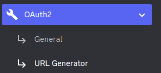

# ChatGPT
A discord bot using openAI's revChatGPT api to act as a smart chat assistant.

Currently setup for a single channel, and a single conversational thread.

Accepts discord file upload of text based files.

Originally forked from https://github.com/acheong08/ChatGPT

Use a version of it live at https://discord.gg/WBKG7VS8Cx

# Setup
## Install
`pip3 install requests discord asyncio typing`
`pip3 install revChatGPT --upgrade`

## Get your session token
Go to https://chat.openai.com/chat and log in or sign up
1. Open console with `F12`
2. Open `Application` tab > Cookies

3. Copy the value for `__Secure-next-auth.session-token` and paste it into `config.json.example` under `session_token`. You do not need to fill out `Authorization`

4. Save your discord api key, and the discord channel id where you would like to interact with the bot in the config file.
5. Save the modified file to `config.json` (In the current working directory)

## Create a discord bot

1. Go to https://discord.com/developers/applications create an application.
2. And build a bot under the application.
3. Get the token from Bot setting.


   
4. Store the token to `config.json` under the `discord_bot_token`

   
5. Turn MESSAGE CONTENT INTENT `ON`

   
6. Invite your bot through OAuth2 URL Generator

   


# Running
```
 $ python3 ChatGPTDiscord.py            
```

## Star History

[](https://star-history.com/#/ausbitbank/ChatGPTDiscord&Date)
